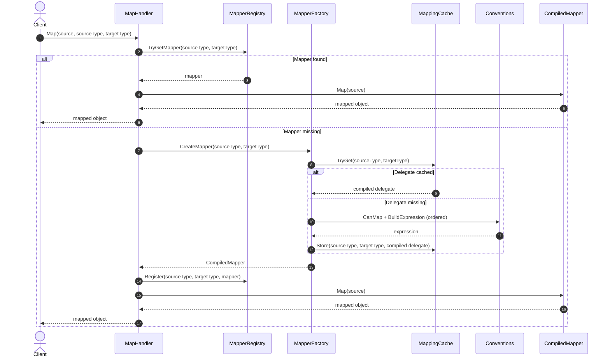

# DIRS21 Dynamic Mapping System Architecture

## 1) Introduction
The DIRS21 Dynamic Mapping System converts external partner models into internal models at runtime.

In plain terms:
- Your app sends a source object to `MapHandler`.
- The system looks for an existing mapper for that source/target type pair.
- If it cannot find one, it builds one using a prioritized strategy pipeline.
- It caches the result so future calls are fast.

This design gives you two benefits at the same time:
1. **Flexibility**: add support for new partner formats without changing core framework classes.
2. **Performance**: once a mapper is created, repeated calls are cache hits.

### 1.1 How to extend for a new partner
To support a new partner model, you generally do **not** edit `MapHandler`, `MapperFactory`, or `MapperRegistry`.

Instead:
1. Create partner DTOs in your integration module.
2. Implement `ITypeMapper<TPartnerSource, TInternalTarget>` (and optionally reverse direction).
3. Register those mappers in DI (`services.AddScoped<ITypeMapper<...>, ...>()`).
4. Use `IMapHandler` in application code.

Because explicit mappers are part of the strategy pipeline, partner-specific behavior can be added safely in modules outside the core framework.

### 1.2 Fallback behavior (what happens if no explicit mapper exists)
The system resolves mapping strategies in this order:
1. **IdentityConvention**: same source and target type -> returns source.
2. **TypeMapperConvention**: uses registered explicit `ITypeMapper<,>`.
3. **CollectionMappingConvention**: maps `List<TSource>` to `List<TTarget>`.
4. **PropertyConvention**: maps matching property names/types.

If none of these strategies can map the type pair, the system throws `MappingNotFoundException` with guidance.

### 1.3 When to use explicit mappers vs conventions
- Use **explicit mappers** for partner integrations and custom business translation.
- Use **conventions** for simple DTO-to-DTO scenarios where names/types already align.

## 2) Core Building Blocks
- `IMapHandler` / `MapHandler`: façade entry point for all map operations
- `IMapperRegistry` / `MapperRegistry`: runtime mapper registry (thread-safe)
- `IMapperFactory` / `MapperFactory`: convention orchestration + mapper creation
- `MappingCache`: compiled delegate cache used by factory
- `ICompiledMapper` / `CompiledMapper<TSource, TTarget>`: runtime-safe wrapper over compiled delegates
- Conventions:
  - `IdentityConvention`
  - `TypeMapperConvention`
  - `CollectionMappingConvention`
  - `PropertyConvention`
- `ExpressionBuilder`: property/nested mapping expression generation
- `Utilities/*`: shared helper utilities for reflection metadata, mapper invocation, and type-mapper metadata

## 3) Convention Priority (Resolution Order)
1. Identity (same source/target type)
2. Explicit mapper strategy (`ITypeMapper<,>` from DI)
3. Collection mapping (`List<T>`)
4. Property convention (name/type match)

This order is critical: explicit partner mappers always win over convention fallback.

## 4) Runtime Mapping Flow
1. Client calls `MapHandler.Map(source, sourceType, targetType)` (or generic overload).
2. `MapHandler` asks `MapperRegistry` for an existing runtime mapper.
3. If missing, `MapHandler` requests creation from `MapperFactory`.
4. `MapperFactory` checks `MappingCache` for a compiled delegate.
5. If no cached delegate exists, it evaluates conventions in order and compiles an expression.
6. `MapperFactory` wraps the delegate in `CompiledMapper<TSource, TTarget>`.
7. `MapHandler` registers the mapper and executes it.

## 5) UML (Class)

Mermaid source is maintained in [docs/diagrams/class-uml.mmd](diagrams/class-uml.mmd).

## 6) UML (Sequence)

## 7) Extensibility and Boundaries
- New partner mappings should be implemented outside core classes via `ITypeMapper<,>`.
- Core framework code remains stable while partner-specific logic is added in external modules.
- If no explicit mapper exists, conventions provide fallback behavior.

## 8) Key Design Constraints
- `MappingExecutionContext` uses `AsyncLocal` context for nested/collection recursion in expression-generated flows.
- Collection convention currently targets `List<T>`.
- Property convention requires exact type match.

## 9) Runtime Safety and Lifetime Behavior
- Runtime `Map(object, Type, Type)` validates that the provided source object is assignable to the declared source type.
- `TypeMapperConvention` resolves explicit mappers per invocation using scope factory, avoiding captured scoped instances.

## 10) Partner Integration Pattern
- Partner-specific DTOs and mappers live under `src/Partners/<PartnerName>`.
- Google partner registration is exposed via `AddGooglePartnerMappings()` in `MappingSystems.Partners.Google.Extensions`.
- Application startup should compose mappings as:
    - `services.AddMapping();`
    - `services.AddGooglePartnerMappings();`

## 11) Operational Notes
- Build: `dotnet build MappingSystem.slnx`
- Tests: `dotnet test MappingSystem.slnx`
- Sample runtime validation: `dotnet run --project samples/MappingSystem.Sample/MappingSystem.Sample.csproj`
