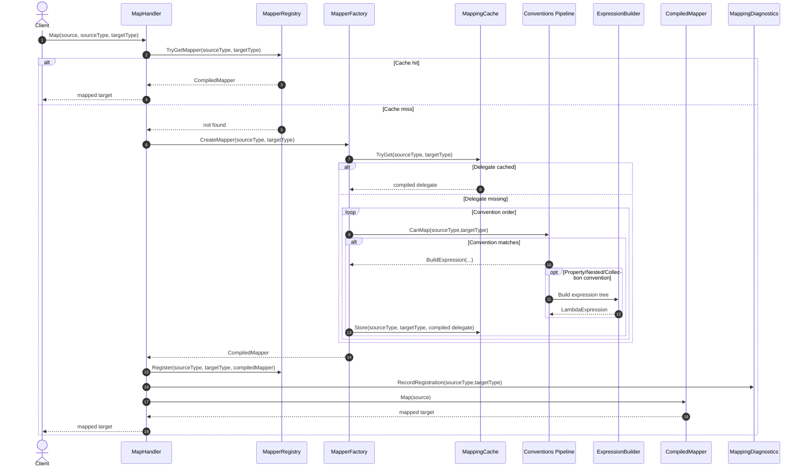
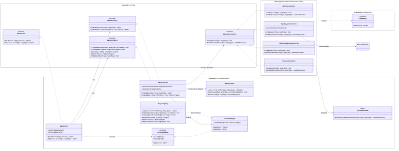

# MappingSystem - System Design Document

## 1. Purpose
MappingSystem is a runtime object-mapping engine for .NET 8 that maps source objects to target objects using a prioritized convention pipeline and compiled-expression caching.

## 2. Scope
This design covers:
- Core mapping pipeline (`MapHandler` -> `MapperRegistry` -> `MapperFactory` -> conventions)
- Convention priority and selection
- Caching model and thread safety
- Nested and collection mapping behavior
- Diagnostics, logging, and error handling

Out of scope:
- Distributed cache/storage
- Cross-process mapper sharing
- Source generators / compile-time mapping

## 3. Goals and Non-Goals
### Goals
- Fast steady-state mapping via cached delegates
- Thread-safe concurrent mapping operations
- Extensible strategy model (`ITypeMapper<TSource,TTarget>`)
- Predictable convention resolution order
- Observability through logs and diagnostics

### Non-Goals
- Automatic mapping for arbitrary incompatible types
- Implicit conversion-heavy mapping semantics
- Multi-tenant global static handler isolation

## 4. High-Level Architecture
### Core Components
- **MapHandler**: Primary façade used by callers.
- **MapperRegistry**: Thread-safe registry of runtime mappers keyed by `(sourceType, targetType)`.
- **MapperFactory**: Creates runtime mappers and orchestrates convention-based expression compilation.
- **MappingCache**: Internal cache of compiled delegates by type pair.
- **CompiledMapper<TSource,TTarget>**: Runtime-safe mapper wrapper over compiled delegate.
- **IMappingConvention implementations**:
  1. `IdentityConvention`
  2. `TypeMapperConvention`
  3. `CollectionMappingConvention`
  4. `PropertyConvention`
- **ExpressionBuilder**: Builds expression trees for property/nested mapping.
- **MappingExecutionContext**: Async-flow context access used by generated nested/collection expressions.
- **Utilities**: shared helper classes for reflection metadata, type-mapper metadata, and runtime mapper invocation.
- **MappingDiagnostics**: Tracks mapper registrations and cache metadata.

### Dependency Injection
`AddMapping()` registers all core services as singletons and convention implementations in priority order.
Partner-specific mappings are registered separately (e.g., `AddGooglePartnerMappings()`).

## 5. Mapping Flow
### Request Path
1. Caller invokes `Map<TSource,TTarget>(source)`.
2. `MapHandler` generic fast path checks typed mapper in `MapperRegistry`.
3. On registry miss, `MapperFactory.CreateMapper<TSource,TTarget>()` is called.
4. `MapperFactory` checks `MappingCache` for compiled delegate.
5. On cache miss, factory evaluates conventions and compiles expression.
6. Factory wraps compiled delegate into `CompiledMapper<TSource,TTarget>`.
7. `MapHandler` registers compiled mapper in `MapperRegistry`.
8. Typed mapper executes and returns target instance.
9. `MappingDiagnostics` is updated for new registrations.

### Runtime `Map(object, Type, Type)`
- Executes a runtime-safe flow using runtime type pair lookup and object mapper invocation.

## 6. Convention Resolution Rules
1. **IdentityConvention**: source type == target type -> pass-through for `string`/value types, deep-copy for mutable reference objects.
2. **TypeMapperConvention**: uses explicitly registered `ITypeMapper<TSource,TTarget>`.
3. **CollectionMappingConvention**: maps `List<TSource>` -> `List<TTarget>` element-by-element.
4. **PropertyConvention**: convention-based property mapping by case-insensitive name + exact type match.

If no convention can map, `MappingNotFoundException` is thrown with actionable guidance.

## 7. Data Model and Caching
### Cache Key
- Tuple key: `(Type Source, Type Target)`.

### Cache Value
- `MapperRegistry`: runtime mapper object (`CompiledMapper<TSource,TTarget>`).
- `MappingCache`: compiled delegate (`Delegate`) used by factory.

### Cache Properties
- Backed by `ConcurrentDictionary`.
- First-writer-wins behavior when concurrent first-map requests occur.

## 8. Thread Safety and Concurrency
- Registry operations are lock-free via `ConcurrentDictionary`.
- Multiple concurrent first-time mapping calls may compile more than once, but only one delegate is retained.
- Mapping execution after cache warm-up is read-heavy and highly concurrent.

## 9. Nested and Collection Mapping
### Nested Objects
- `ExpressionBuilder` detects complex target/source property types.
- Generated expression performs null check and recursively calls `Map<TNestedSource,TNestedTarget>` via `MappingExecutionContext.CurrentHandler`.

### Collections
- `CollectionMappingConvention` generates `source.Select(item => handler.Map<...>(item)).ToList()` with null propagation.

## 10. Error Handling Strategy
- `MappingException`: base type with source/target context.
- `MappingCompilationException`: wraps convention/expression failures.
- `MappingNotFoundException`: emitted when all conventions are exhausted; includes suggestions and convention count.
- Runtime `Map(object, Type, Type)` throws `ArgumentException` when `source` is not assignable to provided `sourceType`.

## 11. Observability
### Logging
- `MapHandler` logs mapping attempts, cache misses, and registrations.
- `MapperFactory` logs convention evaluation and failures.

### Diagnostics API
`IMappingDiagnostics` provides:
- `GetRegisteredMappings()`
- `GetMappingInfo(sourceType, targetType)`
- `GetCacheSize()`

## 12. Performance Characteristics
- Compiled delegates minimize per-call reflection overhead.
- Property metadata caching in `ExpressionBuilder` reduces expression generation overhead.
- Benchmarks and load tests are in `tests/MappingSystem.PerformanceTests`.

## 13. Known Constraints
- Nested/collection recursion relies on `AsyncLocal` flow context; custom threading patterns should preserve logical execution context.
- `CollectionMappingConvention` currently targets `List<T>` mappings.
- Property mapping requires exact type compatibility (no implicit conversion pipeline).

## 14. Sequence Diagram

## 15. Class UML Diagram

Mermaid source: [docs/diagrams/class-uml.mmd](docs/diagrams/class-uml.mmd)

PNG export:

## 16. Future Evolution
- Replace static accessor with explicit handler parameter pipeline for stricter isolation.
- Extend collection support to `IEnumerable<T>`, arrays, and dictionaries.
- Add optional conversion/transform plugins for mismatched property types.
- Consider source-generator mode for AOT-heavy deployments.
